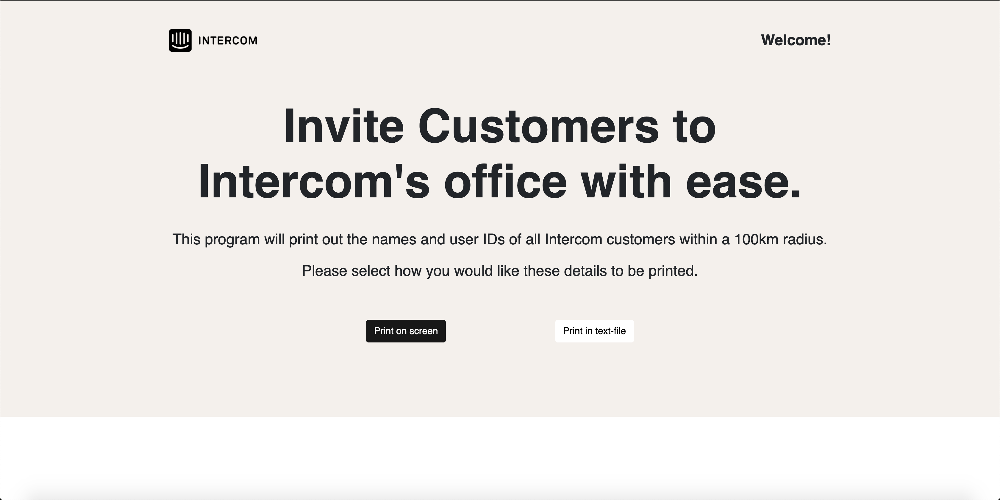
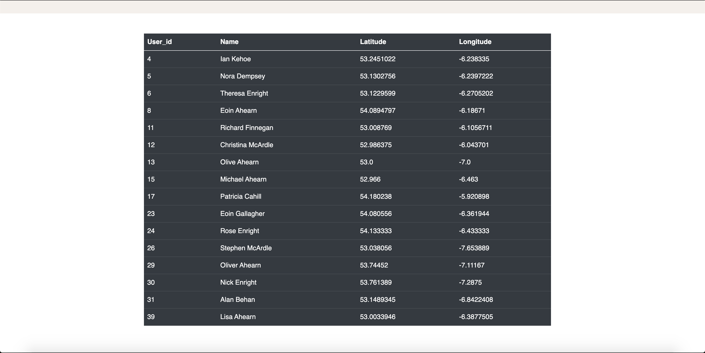
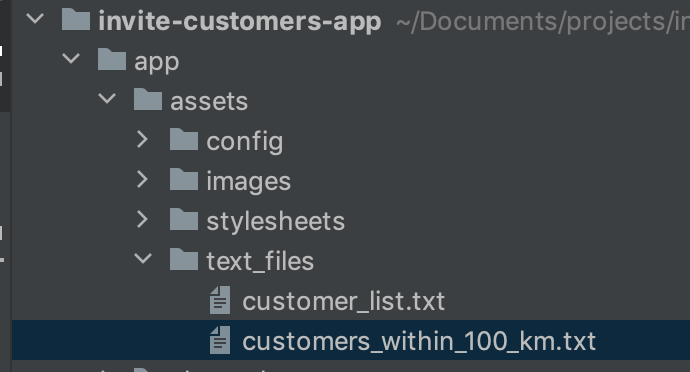
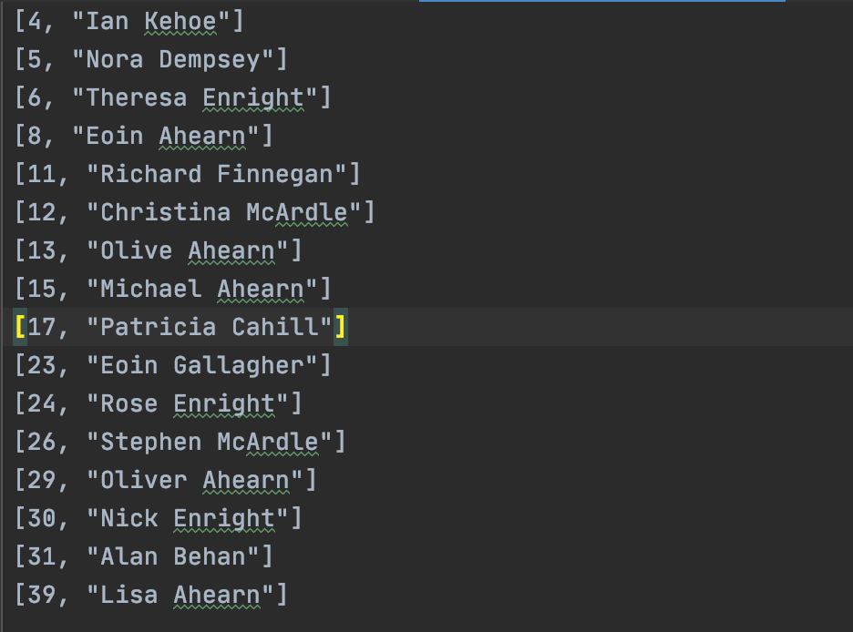

## General info
Invite Customers App is a simple rails application which prints out the names of all Intercom customers within a 100km radius distance. The app uses the great-circle distance formula in it's algorithm to calculate spherical distance. 

There are two options within the application, print to screen and print to file. The application is fully tested with RSPEC unit tests and is optimized for mobile.

	
## Technologies
Project is created with:
* Ruby version 2.7.0
* Rails version 6.0.2
* Bootstrap version 5.0.0.alpha1
* Rspec version 4.0.1
	
## Setup
Firstly clone this repo and navigate to the repo folder: 
```
$ git clone https://github.com/Keith-O-Brien/invite-customers-app.git
$ cd invite-customers-app
```

Bundle the gemfile: 
```
$ bundle install
```

Next update yarn and install the web packages:
```
$ yarn install --check-files
$ npm install
```

Finally set up the app database:
```
$ rake db:{create,migrate}
```

Start the server by running:
```
$ rails s
```

The app can now be viewed in your browser at this URL: http://localhost:3000/

## Usage
When the application loads you will see the home page.

There are two buttons for printing out the Intercom customers within 100km.
Select "Print on Screen" to view the list of available customers in the app, and "Print to file" to write the customer list to a text document. 


Print on screen will give the following result:


Print to file will create a text file in the assets/text_files folder in the apps directory. 
The tree path to the file is as follows:


The file itself will look like this:


Click the Intercom logo in the top left at any point to return to the home screen. Have fun!

## Running tests
RSPEC is used for testing in this application. RSPEC is a behaviour driven test library and is easy to use.

To run all tests for the application simply navigate to the application folder in the terminal and run the following code: 
```
$ bundle exec rspec
```

Unit tests will return either a success or fail result. 


